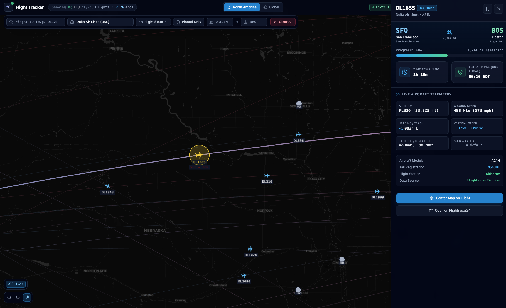
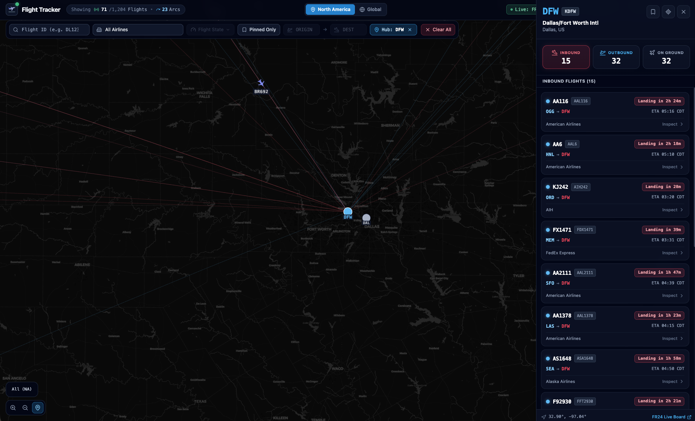
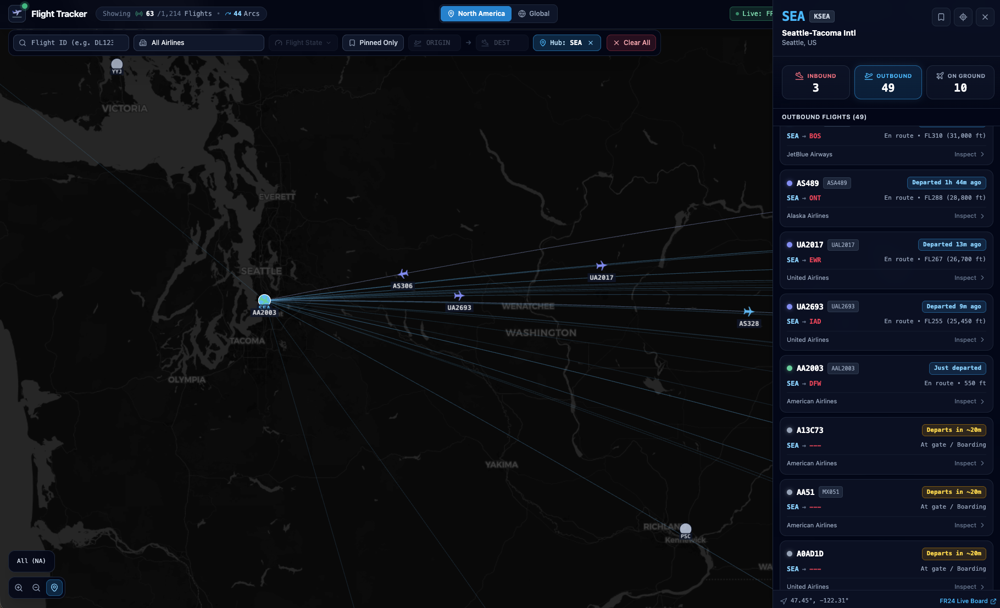

# Flight Tracker

A real-time commercial flight radar and airspace visualization app built with React 19, TypeScript, Deck.gl, and MapLibre GL. It renders live flight locations, route arcs, and airport operations across North America and global airspace.

<!--  -->
---

## Features

### 1. Real-Time Radar Map & Flight Route Arcs
* **Heading-Oriented Aircraft Icons**: Aircraft silhouettes rotate in real-time according to true heading, with colour coding to distinguish between different flights based on current altitude.
* **Route Arcs**: Every airborne flight displays its continuous route arc connecting origin and destination airports. Arcs are strictly bound 1:1 to active flights.
* **Hardware-Accelerated WebGL Rendering**: Uses Deck.gl (`IconLayer`, `ArcLayer`, `ScatterplotLayer`, `TextLayer`) over a Carto Dark Matter base map for smooth 60 FPS rendering with thousands of simultaneous entities.

<!--  -->

### 2. Flight Detail Inspector
Clicking any aircraft opens a slide-out panel with detailed operational data:
* **Route Progress Bar**: Real-time percentage completion along the flight's route.
* **Estimated Arrival Time (ETA)**: Calculated using live ground speed and remaining arc distance, formatted in the **destination airport's local timezone**.
* **Live Telemetry Grid**: Altitude (Flight Level), ground speed (knots), compass heading, vertical rate (fpm), squawk code, and ICAO 24-bit transponder hex.
* **Flight Watchlist**: Pin flights to a personal watchlist stored in `localStorage` that persists across sessions.
* **Direct Links**: Quick jump to the flight's live Flightradar24 page.

<!--  -->
<!--  -->

### 3. Airport Operations & Hub Tracking
Clicking any of the 280+ supported commercial airports opens a dedicated hub panel:
* **Operations Breakdown**: Filterable tabs for **Inbound**, **Outbound**, and **On Ground / Taxiing** flights.
* **Flight Cards with Real Timings**:
  * **Inbounds**: Shows remaining time to touchdown and local ETA.
  * **Outbounds**: Shows departure status for surface flights or elapsed flight time for departures en route.
* **GPS Proximity Guard**: Outbound and ground flight lists verify that aircraft are physically present within 25 nautical miles of the aerodrome, preventing cross-continent false matches.
* **One-Click Hub Filter**: Isolates the map to only show flights originating from or landing at that airport.
* **Custom Hub Bookmarks**: Quick-jump buttons in the bottom-left controls for major hubs (JFK, ORD, LAX, ATL, DFW, YYZ), with saved bookmarks persisted in cookies.

### 4. Search & Multi-Criteria Filtering
* **Flight ID & Callsign Search**: Instant search by commercial flight number (e.g. `DL1234`, `UA240`) or ATC callsign. Taxiing and grounded aircraft matching the search query appear on the map.
* **Airline Filter**: Filter by major carriers (Delta, United, American, Southwest, Air Canada, and others).
* **Route Pair Filter**: Filter by specific origin and destination pairs (`JFK` → `LAX`).
* **Altitude & State Filter**: Multi-select altitude bands or isolate a single band with the "Only" button.
* **Pinned Flights Only**: Isolate your active watchlist on the map.
* **Airport-Context Filtering**: Opening an airport automatically focuses relevant filters and enables inline filtering within the airport drawer.

---

## Data Pipeline Architecture

```
[ Flightradar24 Zone Feed ]  ──(Primary)──┐
                                          ├──> [ Vercel Edge Proxy / Vite Dev Proxy ] ──> [ Normalizer & Geo Utils ] ──> [ Deck.gl WebGL Canvas ]
[ OpenSky Network ADS-B   ]  ──(Secondary)┘
                                          │
[ Simulated Radar Feed    ]  ──(Fallback)─┘
```

The app uses a 3-tier fallback pipeline to guarantee continuous radar display:
1. **Primary Feed (Flightradar24)**: Rich commercial flight feed including aircraft coordinates, altitude, speed, heading, and scheduled origin/destination pairs.
2. **Secondary Feed (OpenSky Network)**: Direct ADS-B state vectors within regional bounding boxes.
3. **Fallback Simulation**: If live feeds are unreachable or rate-limited, the system falls back to an offline simulated feed that advances aircraft along Great-Circle routes.

### Proxy & CORS Handling
Live aviation APIs restrict direct browser requests via CORS and header verification:
* **Local Development**: `vite.config.ts` proxies `/api/fr24` and `/api/opensky` to the upstream servers, attaching the required browser headers.
* **Production**: Lightweight Vercel Edge Functions in `api/fr24.ts` and `api/opensky.ts` execute on Vercel's global edge network to fetch upstream data and return it with open CORS headers.

---

## Tech Stack

* **Framework**: React 19, TypeScript
* **Build Tool**: Vite 8
* **Styling**: Tailwind CSS v4, Lucide Icons
* **Map Engine**: Deck.gl v9 (`IconLayer`, `ArcLayer`, `ScatterplotLayer`, `TextLayer`), MapLibre GL
* **Map Tiles**: Carto Dark Matter
* **Linter**: Oxlint
* **Deployment**: Vercel (Edge Functions + Static SPA)

---

## Project Structure

```
├── api/
│   ├── fr24.ts                # Vercel Edge proxy for Flightradar24 feed
│   └── opensky.ts             # Vercel Edge proxy for OpenSky Network
├── src/
│   ├── api/                   # Client-side API fetchers and fallback data
│   │   ├── flightApi.ts       # Feed orchestrator & FR24 client
│   │   ├── openSkyApi.ts      # OpenSky Network ADS-B client
│   │   └── mockData.ts        # Offline simulation dataset
│   ├── components/
│   │   ├── header/            # Top toolbar, search bar, state filters
│   │   ├── map/               # Deck.gl map, camera controls, custom layers
│   │   │   └── layers/        # Modularized Deck.gl layer definitions
│   │   └── sidebar/           # Flight and airport detail drawers
│   ├── data/
│   │   ├── airlines.ts        # Airline registry and callsign prefix mapping
│   │   └── airports.ts        # 280+ commercial airports with IATA/ICAO indexing
│   ├── hooks/                 # Flight polling and pinned state hooks
│   ├── services/
│   │   ├── filterService.ts   # Multi-filter execution engine
│   │   └── flightProcessor.ts # Normalization and Great-Circle arc generator
│   ├── utils/
│   │   ├── geo.ts             # Haversine distance, bearings, and spherical interpolation
│   │   └── timezone.ts        # Airport IANA timezone resolver
│   └── types/                 # Domain TypeScript interfaces
├── vercel.json                # Vercel rewrite configuration for edge functions
└── vite.config.ts             # Vite build & local proxy configuration
```

---

## Getting Started

### Prerequisites
* Node.js 18+
* npm or pnpm

### Installation

1. Clone the repository:
   ```bash
   git clone https://github.com/jlam323/FlightTracker.git
   cd FlightTracker
   ```

2. Install dependencies:
   ```bash
   npm install
   ```

3. Start the local development server:
   ```bash
   npm run dev
   ```
   Open `http://localhost:5173` in your browser. The Vite proxy will route live flight requests automatically.

### Scripts

* `npm run dev` — Starts local dev server with HMR and live API proxying
* `npm run build` — Runs TypeScript check (`tsc`) and builds production bundle to `dist/`
* `npm run lint` — Runs Oxlint over codebase
* `npm run preview` — Serves local production build

---

## Deployment

This app is configured to deploy both as a standalone domain (e.g. on Vercel) and as a routed subdirectory (e.g. `https://example.com/flighttracker/`):
* `vite.config.ts` uses `base: './'` so all asset URLs and scripts are relative.
* `index.html` includes an inline script to enforce a trailing slash on subdirectory paths so asset paths resolve correctly.
* In production, the Vercel Edge functions in `api/` handle data ingestion without requiring external backend servers.

---

## License

MIT
